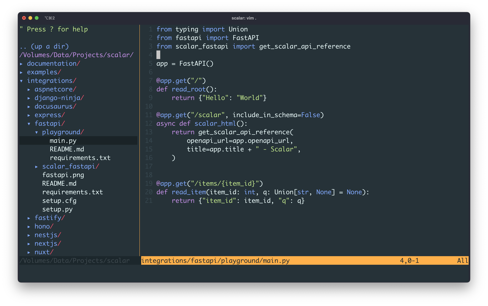

Come on! It's 2025—are you still using [Vim](https://www.vim.org)? Yes, I am! And you probably will too. If you haven't, you're not living
dangerously enough. Certain workflows still require editing files directly on a remote server, or you might find
yourself managing code on a tiny Raspberry Pi tucked in your corner.

I first tried Vim at 17. I know it can be intimidating and frustrating at first, watching true masters in action was
mind-blowing. Today, I'm still no expert, but here are a few essential commands and a simple setup to keep you
productive, or at least interested.

By the way, these commands also work in `vi`, which comes pre-installed on many Linux distributions.

## Exit Vim

The most important command in Vim? The one that gets you out.

When I started, the most intimidating step was opening a file in Vim. Because once you do, there's no clue how to close
it and get back to where you were. The only alternative was to close the entire terminal session.

Well, here you have it. To exit Vim, type:

import Callout from '../../components/Callout.astro';

<Callout description="Exit Vim">
`Esc` and then `:q`
</Callout>

After every command press `Enter`, of course. Remember, *Vim is keyboard-based*.

## Force exit Vim

Very often, you'll get an annoying message saying you can't exit Vim. Maybe there are unsaved changes, or you don't have
permissions to write in the current directory, who cares! You only opened a file to read!

<Callout description="Force exit Vim">
`Esc` and then `:q!`
</Callout>

Once you know how to open a file in Vim and exit Vim, you might feel more comfortable to take the next step:

## Insert content

It often happens: you open a file in Vim, start typing, and... nothing. Then, magically, some text appears. What happened?
You probably pressed `i` at some point. That put Vim into insert mode, now you can insert text before the cursor!

<Callout description="Activate insert mode">
`i`
</Callout>

Press `Esc` to leave insert mode.

## Save changes

<Callout description="Save changes">
`Esc` and then `:w`
</Callout>

Wanna save your changes and exit Vim as fast as possible?

<Callout description="Save changes and exit vim">
`Esc` and then `:wq`
</Callout>

Congratulations! You survived Vim and lived a little dangerously. I managed for years with just these five commands.

There's so much more to learn, but plenty of excellent guides already exist—I have no intention of repeating what's been
explained far better elsewhere.

## A minimal setup

After a while, Vim can get addictive. It's amazing what you can do once you get the hang of it. Let's set it up to
better match my workflow. To do that, we will:

- add a file navigation panel
- add syntax highlighting
- set better defaults

We'll use [vim-plug](https://github.com/junegunn/vim-plug), a popular Vim plugin manager. Install it with:

```sh
curl -fLo ~/.vim/autoload/plug.vim --create-dirs https://raw.githubusercontent.com/junegunn/vim-plug/master/plug.vim
```

Then, add the following to your `~/.vimrc` file to update your Vim configuration.

```viml
" Start the vim-plug plugin manager.
" All plugins listed between plug#begin() and plug#end() will be managed by vim-plug.
call plug#begin()

Plug 'kaicataldo/material.vim', { 'branch': 'main' } " Install the Material color scheme plugin
Plug 'scrooloose/nerdtree'                           " Install the NERDTree plugin

" End the vim-plug plugin block
call plug#end()

set number           " Show line numbers
set showcmd          " Show incomplete commands in the last line of the screen as you type them
set wildmenu         " Enable a visual command-line completion menu
set hlsearch         " Highlight search results
set autoindent       " Automatically indent new lines
set nostartofline    " Keep the cursor in the same column, if possible, when moving around
set ruler            " Show cursor position (line and column) in the status line
set expandtab        " Convert tabs into spaces
set confirm          " Raise a dialog asking if you wish to save the current file(s), instead of failing when closing unsaved files
set smartcase        " Makes searches case-insensitive
set cmdheight=2      " Use 2 screen lines for the command-line, giving space for messages
set termguicolors    " Enable 24-bit RGB color in the terminal for better color schemes support
set fillchars+=eob:\ " Hide tildes beyond the end of the buffer

" Enable mouse support, if possible
if has('mouse')
  set mouse=a
endif

let g:material_theme_style = 'default' " Set the Material color scheme style
colorscheme material                   " Activate the Material color scheme

autocmd VimEnter * NERDTree | wincmd p " Open NERDTree automatically
autocmd BufEnter * if tabpagenr('$') == 1 && winnr('$') == 1 && exists('b:NERDTree') && b:NERDTree.isTabTree() |
    \ quit | endif

" Make the horizontal divider more visible
highlight StatusLine   cterm=NONE ctermfg=black ctermbg=DarkYellow guifg=#1c272c guibg=#ffb04b
highlight StatusLineNC cterm=NONE ctermfg=black ctermbg=Grey       guifg=#3e494f guibg=#1c272c

" Configure the vertical divider
highlight VertSplit cterm=NONE ctermfg=Yellow ctermbg=NONE guifg=#ffb04b guibg=NONE
set fillchars+=vert:│
```

Some of these settings really ought to be the default! Anyway, open Vim, you should see something like this:



Try splitting your screen:

<Callout description="Split your screen horizontally">
`Esc` and then `:sp`
</Callout>

You can switch between editors clicking on the desired pane. You can also try resizing the panes by dragging the
separator with your mouse.

And that's it!

Vim is still very much alive, and for good reasons. It's powerful, flexible and remains essential even to those who
prefer modern IDEs, like me.

There's a huge Vim community, explore the many plugins available, like the official [Github Copilot
plugin](https://github.com/github/copilot.vim). Who knows, you might find yourself spending far more time in Vim than
you planned...

## Face your fears!

If you run from them, they will chase you your whole life.

Vim was one of mine. So I forced myself to use it daily by making it the default Git editor for commits. If you want to
try the same, here's how to configure Git:

```sh
git config --global core.editor "vim"
```

I encourage you to find a workflow where Vim becomes a natural part of your day-to-day.
