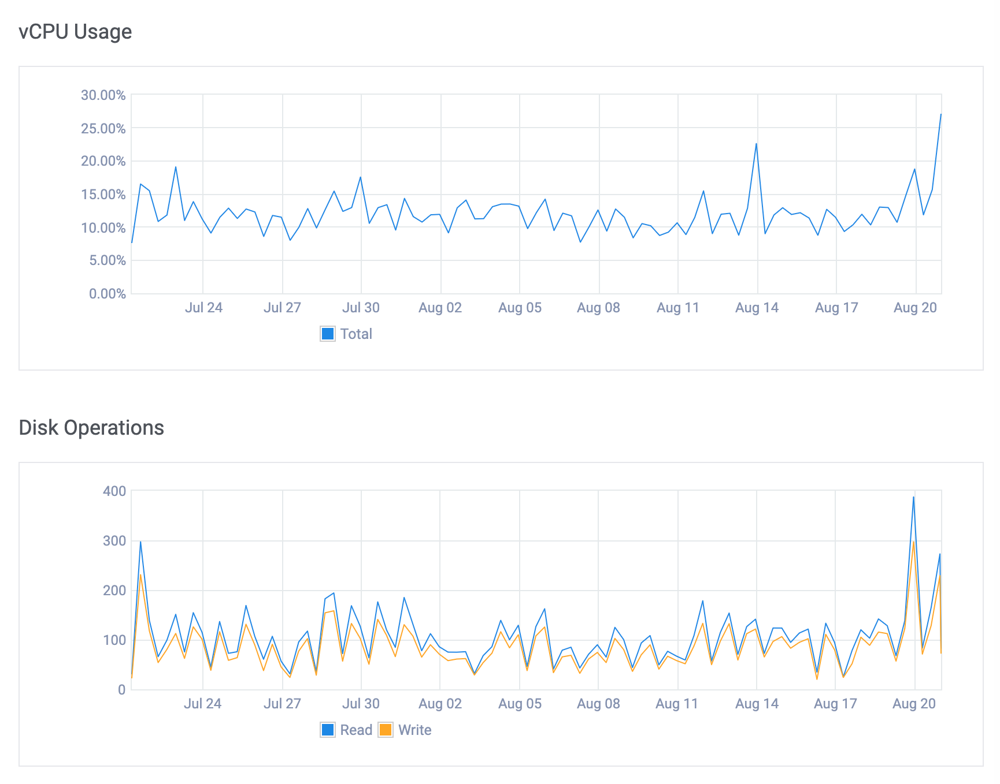

Many startups pour massive amounts of money into building highly resilient infrastructure from day one. I find it funny
how so much energy is often poured into infrastructure, yet code quality often gets neglected. My take on
infrastructure: start lean, measure usage, then upgrade only when data shows a bigger setup is required.

For the past 8 years, I've been running a volunteer shifts app with over 30,000 MAU on a single shared vCPU instance
costing just $24 a month. It runs every service the app needs, except email, and requires very little maintenance.
Despite its simplicity, it can handle around 50 requests _per second_.

## The app

The app itself is built with Python, using [FastAPI](https://fastapi.tiangolo.com) at its core. It exposes a REST API,
connects to a PostgreSQL database, caches data in Redis, and runs background jobs with
[Huey](https://github.com/coleifer/huey). The same Python app serves a React app.

[Gunicorn](https://gunicorn.org) is the HTTP server, with [uvicorn workers](https://www.uvicorn.org/deployment/#gunicorn),
6 of them handle all the traffic.

## The virtual machine

Over the years, I experimented with different providers and eventually settled on [Vultr](https://www.vultr.com). To my
surprise, it proved far more reliable than [DigitalOcean](https://www.digitalocean.com), consistently keeping its 100% SLA.

I deployed what Vultr calls a High Performance Cloud Compute instance: 2 shared AMD EPYC vCPUs, 4 GB of memory, and 100
GB of storage. Here's an overview of the machine's usage:

The usual load is 30 requests a minute. Python apps of this kind can be more memory-intensive than CPU-intensive.

## The PaaS

I've always loved the simplicity of [Heroku](https://www.heroku.com). It lets you forget about infrastructure almost
entirely. Unfortunately, for this project, Heroku was far too expensive. We were working with a very limited budget,
and every dollar mattered.

The solution? [Dokku](https://dokku.com), an open-source alternative to Heroku. Some of its features:

- It's powered by [Docker](https://www.docker.com)
- Uses [nginx](https://nginx.org) as the reverse-proxy by default
- Ships with [Vector](https://vector.dev) for log management
- Provides an API very similar to Heroku's
- There's a rich ecosystem of plugins available
- You can deploy any `Dockerfile`

[Here](https://gist.github.com/josuemontano/56ec527722a77c87c004476cff3302cc) you'll find the gist of the setup required
for this server. Add a remote to your git repo and you are ready to deploy with just `git push`!

Check the [Dokku ACL plugin](https://github.com/dokku-community/dokku-acl) if you need to manage users and their
permissions. On the other hand, the postgres and redis plugins allow you to schedule encrypted backups to S3.

Over the years, Dokku has introduced very few breaking changes, which makes maintaining it effortless.

## A stress test

To evaluate the app's performance under load, I ran a stress test on one of its REST endpoints. Each request cycle
involves authenticating the current user, executing multiple queries against the PostgreSQL database, and serializing
roughly 20KB of data.

The following table shows the response times in milliseconds of a sample of ~8,000 requests:

| req/sec | p50     | p90     | max     |
| ------- | ------- | ------- | ------- |
| 50      | 483.01  | 696.818 | 1373.95 |
| 100     | 869.33  | 1587.8  | 3562.0  |
| 200     | 1983.95 | 3258.23 | 8347.38 |

It's worth noting that the PostgreSQL database is small — every year we add about 100 MB of data. But that's exactly the
data that matters for the app and our users.

import AsciinemaPlayer from '../../components/AsciinemaPlayer.astro';

<AsciinemaPlayer src='/casts/2025_08_21_infrastructure_on_a_budget_vps_100.cast' cols={138} rows={26} speed={2} description="Load on the server while serving 100 requests per second"/>

## Next steps

Yes, there's more work involved when configuring the server for the first time. You'll want to disable root password
login, enforce SSH key access for all users, configure the firewall, tweak PostgreSQL and so on. And you should
definitely proxy the app behind [Cloudflare](https://cloudflare.com/). We also haven't discussed provisioning new
servers for test environments, or setting [OpenTelemetry](https://opentelemetry.io) up for observability.

Still, you can have a solid environment up and running in half a day — it usually takes me less than 2 hours to set up a
new server and deploy an app to production using this workflow.

## Final thoughts

Can you really rely on a single server? I've done it for the past few years, and I think you might be able to get away
with it for a while, too. More often than not, it's GDPR, not traffic, that forces to deploy a second server. Therefore,
make sure your setup can be easily reproduced. A Docker-based workflow will give you the flexibility to migrate to k8s
when —and if— needed.

> Good architecture lets you defer decisions for as long as possible

Should you deploy your app and all its services on a single shared vCPU machine? Probably not. Still, I hope this demonstrates
just how much you can accomplish with minimal resources.
