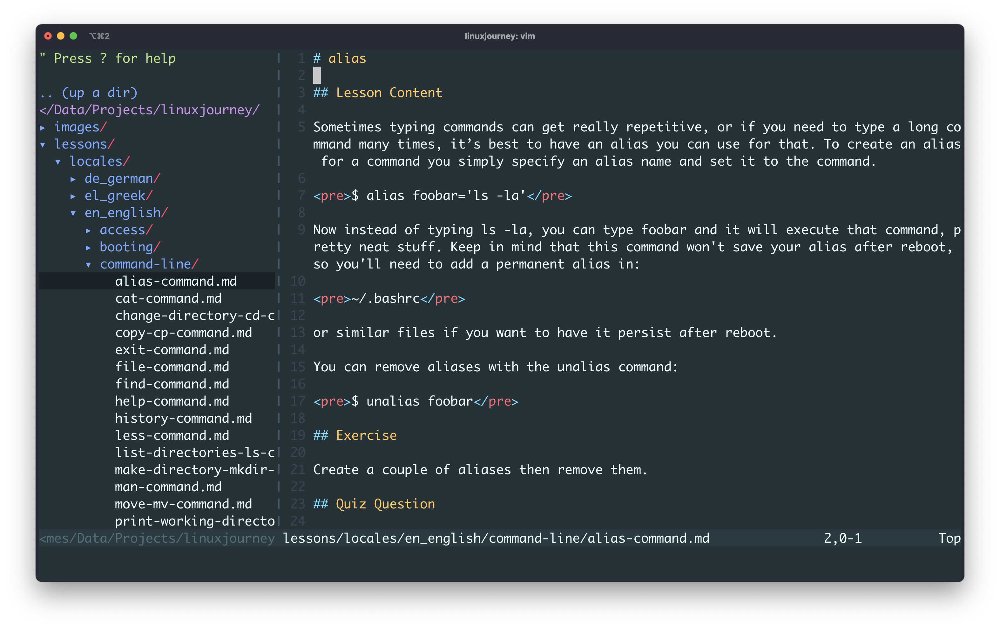

Come on! It's 2025—are you still using Vim? Yes, I am! And you probably will too. If you haven't, you're not living
dangerously enough. Many workflows still require editing files directly on a remote server—or managing code on a tiny
Raspberry Pi tucked in your corner. Since I often work in the terminal, I decided to give my Vim setup a proper spin.

I first tried Vim at 17. I know it can be intimidating and frustrating at first, watching true masters in action was
mind-blowing. Today, I'm still no expert, but here are five essential commands and a simple setup to keep you
productive.

## Exit Vim

This could be the most important command. Because the scariest step might be opening a file in Vim, to start with. Once
you do, there's no clue how to close it and get back to where you were. To exit it type:

import Callout from '../../components/Callout.astro';

<Callout description="Exit Vim">
`Esc` and then `:q`
</Callout>

Yes, just type that. No need to move the cursor or do anything else. *Vim is keyboard-based*.

## Force exit Vim

Very often, you'll get an annoying message saying you can't exit Vim. Maybe there are unsaved changes, or you don't have
permissions to write in the current directory, who cares! You only opened a file to read!

<Callout description="Force exit Vim">
`Esc` and then `:q!`
</Callout>

Once you know how to open a file in Vim and exit Vim, you might feel more comfortable to take the next step:

## Insert content

It often happens: you open a file in Vim, start typing, and... nothing. Then, magically, some text appears. What happened?
You pressed `i` at some point. That key puts Vim into insert mode, now you can insert text before the cursor!

<Callout description="Activate insert mode">
`i`
</Callout>

## Save changes

<Callout description="Save changes">
`Esc` and then `:w`
</Callout>

Wanna save your changes and exit Vim as fast as possible?

<Callout description="Save changes and exit vim">
`Esc` and then `:wq`
</Callout>

Congratulations! You survived Vim and lived a little dangerously. I managed for years with just these five commands.
There's so much more to learn, but plenty of excellent guides already exist—I have no intention of repeating what's been
explained far better elsewhere.

## A minimal setup

After a while, Vim can get addictive. It's amazing what you can do once you get the hang of it. Let's set it up to
better match my workflow. To do that, we will:

- add a file navigation panel
- add syntax highlighting
- set better defaults (better for me, at least)

We'll use [vim-plug](https://github.com/junegunn/vim-plug), a popular Vim plugin manager. Install it with:

```sh
curl -fLo ~/.vim/autoload/plug.vim --create-dirs https://raw.githubusercontent.com/junegunn/vim-plug/master/plug.vim
```

Then copy this Vim configuration to the `~/.vimrc` file.

```viml
" Start the vim-plug plugin manager.
" All plugins listed between plug#begin() and plug#end() will be managed by vim-plug.
call plug#begin()

Plug 'kaicataldo/material.vim', { 'branch': 'main' } " Install the Material color scheme plugin
Plug 'scrooloose/nerdtree'                           " Install the NERDTree plugin

" End the vim-plug plugin block
call plug#end()

set number        " Show line numbers
set showcmd       " Show incomplete commands in the last line of the screen as you type them
set wildmenu      " Enable a visual command-line completion menu
set hlsearch      " Highlight search results
set autoindent    " Automatically indent new lines
set nostartofline " Keep the cursor in the same column, if possible, when moving around
set ruler         " Show cursor position (line and column) in the status line
set expandtab     " Convert tabs into spaces
set confirm       " Raise a dialog asking if you wish to save the current file(s), instead of failing when closing unsaved files
set smartcase     " Makes searches case-insensitive
set cmdheight=2   " Use 2 screen lines for the command-line, giving space for messages
set termguicolors " Enable 24-bit RGB color in the terminal for better color schemes support

" Enable mouse support, if possible
if has('mouse')
  set mouse=a
endif

let g:material_theme_style = 'default' " Set the Material color scheme style
colorscheme material                   " Activate the Material color scheme

autocmd VimEnter * NERDTree | wincmd p " Open NERDTree automatically
autocmd BufEnter * if tabpagenr('$') == 1 && winnr('$') == 1 && exists('b:NERDTree') && b:NERDTree.isTabTree() |
    \ quit | endif
```

Some of these settings really ought to be the default! Anyway, open Vim, you should see something like this:



There's a huge Vim community, explore the many plugins they available. Who knows, you might be tempted to spend more time on
it...

## Face your fears!

One last tip: face your fears. If you run from them, they will chase you your whole life. I forced myself to use Vim
daily by making it the default Git editor for commits. Here’s how to configure Git:

```sh
git config --global core.editor "vim"
```

I encourage you to find a workflow where Vim becomes a natural part of your day-to-day.
